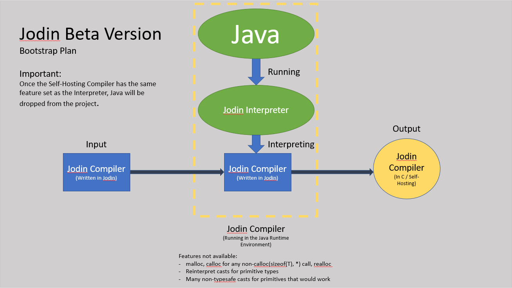

# Jodin Java Bootstrap


> The bootstrap for the Jodin language.

> Eventually, this entire app will be replaced with a compiler written in Jodin

### Table of Contents

1. Basics
2. Main Additions to C
    - Classes
    - Namespaces
    - Modified entry point
    - Additional exact type sizes for primitives
3. The Interpreter
4. Portability
    - Standard Library
    - Toolchains for portability
4. Future Plans
    - Jodin Compiler written in Jodin
    - Finely Tuned Importing
5. Code Examples
6. Experimental Features
    

### Basics

What is Jodin? Jodin is an Object-Oriented language, built off of the C-Language.
Theoretically, any program written in C should result in a 1-1[<sup>1</sup>](#Footnotes) mapping after compilation.
> In fact, using the C Backend, a program outputed by the Jodin Compiler can be sent back into the compiler, and shoud
result in the same file.

### Main Additions To C
These are currently 

#### Classes

Class are written using the follow syntax

```
class IDENTIFIER (: PARENT_IDENTIFIER)? {
    (public|private)? TYPE field_name;
            or
    (public|private)? CLASSNAME(parameters?);
            or
    (public|private)? CLASSNAME(parameters?) (: (this|super)(arguments?))? {
        /* snip */
    }
            or
    (virtual)? (public|private)? returntype methodName(parameters?);
            or
    (virtual)? (public|private)? returntype methodName(parameters?) {
        /* snip */
    }
    .
    .
    .
};
```

Once implement blocks are fully working, you can declare functions in the class header,
then define them using the following syntax:

```cpp
implement CLASSNAME returntype methodName(parameters?) {
    /* snip */
}
implement CLASSNAME CLASSNAME(parameters?) (: (this|super)(arguments?))?  {
    /* snip */
}
```
or you can do multiple implementations with
```cpp
implement CLASSNAME {
    returntype methodName(parameters?) {
        /* snip */
    }
    
    CLASSNAME(parameters?) (: (this|super)(arguments?))?  {
        /* snip */
    }
    .
    .
    .
}
```

> Constructors call prior constructors using the `: (this|super)(arguments?)` syntax. Although its not necessary to actually
>use prior constructors[<sup>2</sup>](#Footnotes)

> Constructors return pointers to the heap.

#### Namespaces

In order to facilitate cleaner and clearer programs, classes can be declared within namespaces using
the `in IDENTIFER` command

The `in` command can either be followed by a class or by a block containing multiple classes and functions.
Functions names are not affected by it's namespace, currently.

Classes within a namespace can be referred to outside of it's namespace by using `namspace::classname`.

Namespaces can also be nested, for example:
```
in animals {
    in mammals {

        class Dolphin {

            /* snip */

        }
    }
}
```
In this example, outside of the namespaces, you would refer to the Dolphin class as `animals::mammals::Dolphin`.
If you are in a function that's declared in a `in animals` block, it could be referred to using just `mammals::Dolphin`
Namespace paths are relative to the current namespace, however all any namespace path also checks for an absolute instance,
so you could still refer to it using `animals::mammals::Dolphin` within the `in animals` block.

>Classes can't be have two different definitions within the same namespace, but in the case that a namespace path determines
>that there could be multiple classes being referred to by a path, the compiler will spit out an error, like so:
>In namespace.cx:
>```
>AmbiguousIdentifierError: Ambiguous Identifier
>    |
> 18 |     ko::object* o; // Should be an ambiguous reference
>    |            ^_________________________________________________ Could be CXClass ko::object or CXClass std::ko::object
>```

#### Modified Entry Point
The entry point of jodin projects must be of the following signature:
```
int main(int argc, std::String args[])
```
The compiler will let let you know if your main function is incorrect, or doesn't exist


#### Additional exact type sizes for primitives
In addition to the standard C primitives, additional type definitions exist to improve
readability and portability of code. It is recommended to use these types over other the
C primitives.
These types are
- Signed
    - `i8` for range of −128 to +127
    - `i16` for range of −32,768 to +32,767
    - `i32` for range of −2,147,483,648 to +2,147,483,647
    - `i64` for range of −9,223,372,036,854,775,808 to +9,223,372,036,854,775,807	
    - `isize` (pointer size)
- Unsigned
    - `u8` for range of 0 to 255
    - `u16` for range of 0 to 65,535
    - `u32` for range of 0 to 4,294,967,295
    - `u64` for range of 0 to 18,446,744,073,709,551,615
    - `usize` (pointer size)
- `bool` (equivalent to `u8`)
- `size_t` (equivalent to `usize`)

#### Free Standing Strings

Character string literals are automatically turned into objects of the String class. The backing `char*` can be accessed using the `getCStr()` method. This allows for this
```
usize len = ("hello").length();
```
to be valid.


The Interpreter
---

Included as well is a jodin interpreter.

This interpreter will allow for an alternate approach for bootstrapping the Jodin Compiler.

Currently the interpreter works on a basic level, but is very slow. Improvements must be mad to make it actually usable.

However, once its fully functioning, the Jodin compiler will be compiled as follows:



Portability
---

#### The Standard Library

Included with Jodin is a set of common header files. Along with this, there are a few `core` files that are included with
every Jodin project that allows for the common header files to function.

The goal is for the standard library headers to be a superset of what's available in C.


#### Toolchains for Portability


A toolchain is a directory layout that is either in the new `$JODIN_HOME/toolchains` folder, or in a local directory named `.toolchains`. In this directory, there is also a config file, like so:

```
type = interpreter					# either interpreter or compiler
toolchain = ./interpreter                         # relative position of the current toolchain
experimental = false
opt-level = 0
trycatch = false
stacktrace = true
autostring = false
```

Each toolchain at the minimum must have the following structure
```
- TOOLCHAIN/
    - include/
       -toolchain/
           - defines.h
       - host_hook.h/
    - src/
       - toolchain.jdn
```

>This is subject to change

The `defines.h` file defines some types for the core library
The `host_hook.h` file is where the toolchain defines all of the functions that it won't define, but the host, for example the Interpter, will.
The `toolchain.jdn` file is where the `system/toolchain.h` file in the standard library headers is implemented. Every in the `system/toolchain.h` must be defined as part of the toolchain.

With the `core` source files, `toolchain` source files, and the generated `runtime.jdn` file created by the compiler, every Jodin project can now be compiled without having to adjust any code, as all potential differing code is taken care of by the toolchain.

Future Plans
---
There are listed in no particular order.

#### Jodin Compiler written in Jodin
This is the next big step for Jodin, and will signify that it's hit a "mature" state. Once a compiler is
successfuly written in Jodin that is either equal or a superset of the Java bootstrap, this will be
the "beta" point of Jodin.

##### Features needed for a self-hosted compiler
These are the features that I have determined are necessary for work on the self-hosted compiler to begin.

| Feature           | Implementation Status |
|:------------------|----------------------:|
| Generics          | AST Done                  |
| Compilation Tags  | Completed                  |
| Preamble          | Working State         |
| Object base class | Completed             |
| String class      | Work in progress      |
| Exception Handling| None                  |
| Interfaces        | None                  |
| Implement Block   | Completed             |
| Runtime Class Info| Works in a non static context                  |


##### Automatic Derefrencing
Class objects can only ever exist as pointers within a Jodin program, but they must be interacted in the c-mannered way (though derefrencing). With this
in mind, it might be optimal to allow for class object pointers to be automatically dereferenced.

Bare minimum should be just `class T*` types to be able to handle auto-derefrencing.

##### Preamable
The preamble AST will be attached to the top of every file being compiled.

The preamble will contain import important information, but most importantly will
bring the `std::Object` base class into the file with `using std::Object as Object`, and set the
default inherit to `std::Object`.

The definition of Object will be as followed
```

in std class ClassInfo;

in std class Object { // default inheritence is initially null
    private ClassInfo info;
    private long references; // if using garbage collection

    public Object();

    virtual public int hashcode();

    virtual public int equals(Object other);
    virtual public void drop();

    virtual public std::String toString();
};
```


#### Finely Tuned Importing
Using the statement as a top level declaration `using namespace::identifer;` will automatically bring the declarations
and fields of a class into the file. If the identifier has not been found yet, the file being compiled will be put
on hold until the declaration is found.
>In the case of a circular dependency, the compiler will attempt to be break the circle by checking if the class is ever
>actually interacted with. If it isn't, its replaced with `in namespace class identifier;`. Otherwise it reports as an
>error

> If the namespace is `std`, then it will find the appropriate standard file in the standard library to include in the
>output.


Experimental Features
---

#### Stack trace
Section coming son

Code Examples
---

##### Inheritance Example, along with namespaces
```
void print(char* name);
void println(char* name);

in animals {
	class animal {
		private char* species;
		private int numberOfLegs;

		public animal(char* species, int numberOfLegs) {
			this->species = species;
			this->numberOfLegs = numberOfLegs;
		}

		public int getNumberOfLegs() {
			return this->numberOfLegs;
		}

		virtual public void says() {
			print(this->species);
			print(" says ");
		}
	};

	class quadAnimal : animal {

		public quadAnimal(char* name) : super(name, 4) {}

		virtual public void says() {
			super->says();
			print("I have 4 legs!");
        }
	};

	class domesticated : quadAnimal {
		private char* name;

		public domesticated(char* name, char* species) : super(species) {
			this->name = name;
		}

		public char* getName() {
			return this->name;
		}

		virtual public void says() {
			print(this->getName());
			print(" the ");
			super->says();
			print(", also ARF");
		}
	};

	class dog : domesticated {

		public dog(char* name) : super(name, "dog") { }

		public dog() : this("unknown") { }


	};
}

class cat : animals::domesticated {

	public cat(char* name) : super(name, "cat") {}

	virtual public void says() {
		println("I'm a cat, shove off");
	}
};


int main() {

	animals::animal griff = new animals::dog("The Griff");

	griff->says();
	println("");
	griff->says();
	println("");


	animals::domesticated myCat = new cat("jeff");
	myCat->says();

	return 0;
}
```
Upon compiling this code into C, then compiling that into an executable, this is what is outputted:
```
The Griff the dog says I have 4 legs!, also ARF
The Griff the dog says I have 4 legs!, also ARF
I'm a cat, shove off
```
---
### Footnotes
1. There will be some variation in the code, ie: all operations are put into parentheses, as
the actual parentheses are currently lost in parsing
2. This may change at a later time to require calling prior constructors if the super class doesn't contain any
`(void)` constructors

